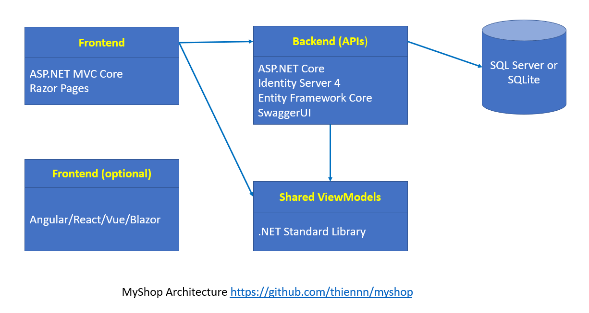

# NashEcommerce
Stage 1 Challenge

live preview - azure 
- [admin](https://saonggieoi.z23.web.core.windows.net) *enable popup window to authentication*
- [client](https://customersite-onggieoi.azurewebsites.net)
- [backend](https://backend-onggieoi.azurewebsites.net/api) *api*
---
## Docs
- [admin](https://github.com/onggieoi/NashEcommerce/tree/master/admin)
- [client](https://github.com/onggieoi/NashEcommerce/tree/master/client)
- [backend](https://github.com/onggieoi/NashEcommerce/tree/master/backend)
## Architecture

- backend: **api** dotnet5 - **oauth** identity server - **ORM** EF core
- client: dotnet5 mvc razor 
- admin: [reactjs - typescript - tailwind scss](https://github.com/onggieoi/Codebase-Reactjs) redux-saga - oidc-client.js
- database: MSSQL

---

## OAuth Flows

OAuth 2.0 [RFC6749](https://tools.ietf.org/html/rfc6749) protocol
[Open-Id](https://openid.net/specs/openid-connect-core-1_0.html)

### Authorization Code Grant (client - backend)
<pre>
     +----------+
     | Resource |
     |   Owner  |
     |          |
     +----------+
          ^
          |
         (B)
     +----|-----+          Client Identifier      +---------------+
     |         -+----(A)-- & Redirection URI ---->|               |
     |  User-   |                                 | Authorization |
     |  Agent  -+----(B)-- User authenticates --->|     Server    |
     |  (web    |                                 |               |
     | browser)-+----(C)-- Authorization Code ---<|               |
     +-|----|---+                                 +---------------+
       |    |                                         ^      v
      (A)  (C)                                        |      |
       |    |                                         |      |
       ^    v                                         |      |
     +---------+                                      |      |
     |         |>---(D)-- Authorization Code ---------'      |
     |  Client |          & Redirection URI                  |
     |         |                                             |
     |         |<---(E)----- Access Token -------------------'
     +---------+       (w/ Optional Refresh Token)

</pre>
- (A)  The client initiates the flow by directing the resource owner's
user-agent to the authorization endpoint.  The client includes
its client identifier, requested scope, local state, and a
redirection URI to which the authorization server will send the
user-agent back once access is granted (or denied).
- (B)  The authorization server authenticates the resource owner (via
the user-agent) and establishes whether the resource owner
grants or denies the client's access request.
- (C)  Assuming the resource owner grants access, the authorization
server redirects the user-agent back to the client using the
redirection URI provided earlier (in the request or during
client registration).  The redirection URI includes an
authorization code and any local state provided by the client
earlier.
- (D)  The client requests an access token from the authorization
server's token endpoint by including the authorization code
received in the previous step.  When making the request, the
client authenticates with the authorization server.  The client
includes the redirection URI used to obtain the authorization
code for verification.
- (E)  The authorization server authenticates the client, validates the
authorization code, and ensures that the redirection URI
received matches the URI used to redirect the client in
step (C).  If valid, the authorization server responds back with
an access token and, optionally, a refresh token.

### Implicit Grant (admin - backend)
<pre>
    +----------+
    | Resource |
    |  Owner   |
    |          |
    +----------+
         ^
         |
        (B)
    +----|-----+          Client Identifier     +---------------+
    |         -+----(A)-- & Redirection URI --->|               |
    |  User-   |                                | Authorization |
    |  Agent  -|----(B)-- User authenticates -->|     Server    |
    |          |                                |               |
    |  (aka    |<---(C)--- Redirection URI ----<|               |
    |   web    |          with Access Token     +---------------+
    | browser) |            in Fragment
    |          |                                +---------------+
    |          |----(D)--- Redirection URI ---->|   Web-Hosted  |
    |          |          without Fragment      |     Client    |
    |          |                                |    Resource   |
    |     (F)  |<---(E)------- Script ---------<|               |
    |          |                                +---------------+
    +-|--------+
      |    |
     (A)  (G) Access Token
      |    |
      ^    v
    +------------+
    |   Client   |
    | JavaScript |
    |            |
    +------------+
</pre>
- (A)  The client initiates the flow by directing the resource owner's
user-agent to the authorization endpoint.  The client includes
its client identifier, requested scope, local state, and a
redirection URI to which the authorization server will send the
user-agent back once access is granted (or denied).
- (B)  The authorization server authenticates the resource owner (via
the user-agent) and establishes whether the resource owner
grants or denies the client's access request.
- (C)  Assuming the resource owner grants access, the authorization
server redirects the user-agent back to the client using the
redirection URI provided earlier.  The redirection URI includes
the access token in the URI fragment.
- (D)  The user-agent follows the redirection instructions by making a
request to the web-hosted client resource (which does not
include the fragment per [RFC2616]).  The user-agent retains the
fragment information locally.
- (E)  The web-hosted client resource returns a web page (typically an
HTML document with an embedded script) capable of accessing the
full redirection URI including the fragment retained by the
user-agent, and extracting the access token (and other
parameters) contained in the fragment.
- (F)  The user-agent executes the script provided by the web-hosted
client resource locally, which extracts the access token.
- (G)  The user-agent passes the access token to the client.
